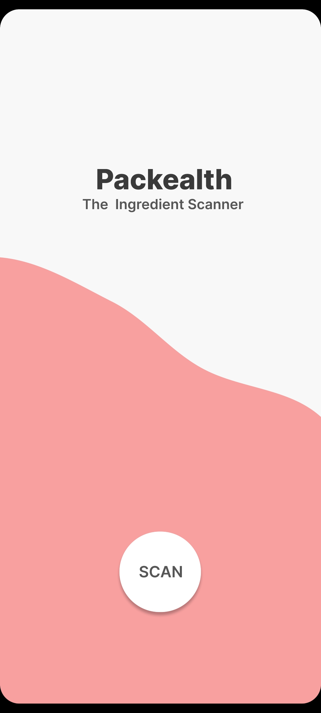
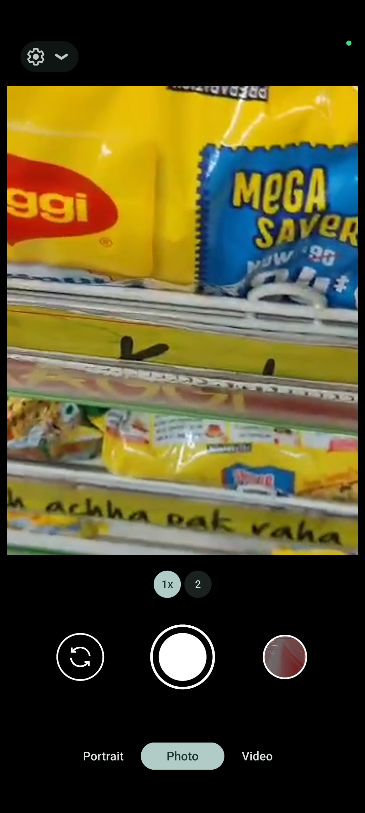
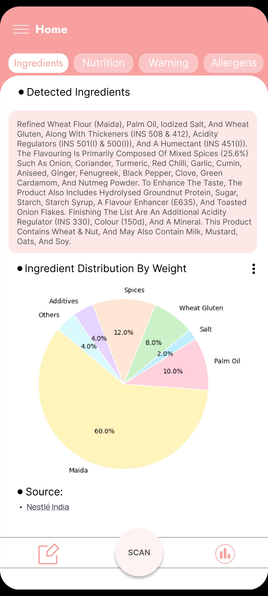
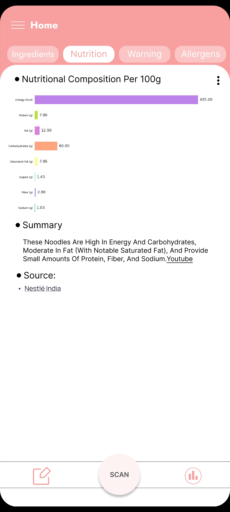
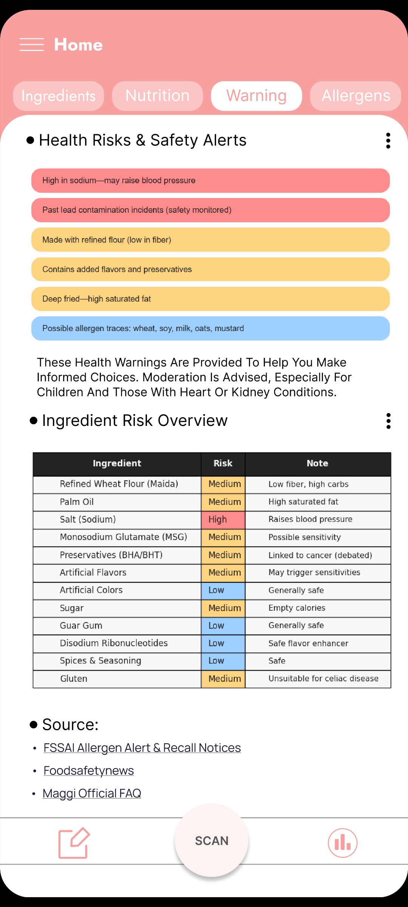
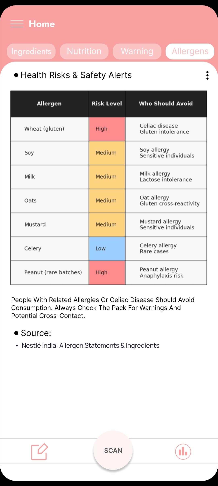

## 🎬 Demo Video (Private)

[Watch Packealth demo here](https://www.youtube.com/shorts/8Fc3vU0wrPM)  
*(Accessible only to project visitors)*

# 🥫 Packealth: The Ingredient Scanner

## 📱 App Screens & Workflow
Below are screenshot highlights showing the complete Packealth user journey, from scanning a product to viewing detailed health and nutrition insights.
---

### 1. Analysis Progress
  
Soft pink progress screen with "Analysis In Progress..." and a loading indicator.

---

### 2. Splash Screen
  
Packealth app welcome screen with a modern design, logo, and a "SCAN" button.

---

### 3. Home & Ingredient Insights
  
Detected product ingredients, a pie chart for ingredient breakdown by weight, and tabbed navigation for ingredients, nutrition, warnings, and allergens.

---

### 4. Camera Scanner
  
Live package-scanning interface allowing users to capture product images in-store.

---

### 5. Nutrition Screen
  
Nutritional breakdown per 100g with bar graph, summary text, and a data source link.

---

### 6. Allergen Risks
  
Health risks and allergens overview with a color-coded allergen table and advisory guidance.

---

### 7. Ingredient Risk Warnings
  
Ingredient warnings, risk overview, and color-coded table helping users make safe food choices.

# 🖼️ App Screenshots
See the app screens:
[Google Drive Screenshot Gallery](https://drive.google.com/drive/folders/1KYVSxLlUy2yy0dBuD2RQg_GSVbpH_aGK?usp=sharing)
***

## 🥗 Packealth: Instant Food Ingredient & Nutrition Analyzer  
Packealth is a free Flutter app that lets users scan or upload photos of packaged foods or ingredients, instantly extracting and visualizing nutrition facts, ingredient risks, and potential health hazards via a modern, interactive dashboard.

***

### 📝 Overview
Packealth empowers safer and smarter food decisions by turning any product label into actionable health insights:
- 📷 **Scan or upload:** Capture nutrition labels or ingredient lists using your device camera or from gallery images.
- 🤖 **AI-powered text extraction:** Google ML Kit OCR reads and parses all ingredients and nutrition facts on-device.
- 📊 **Interactive dashboard:** See real-time calories, protein, fat, carb, and additive values via color-coded bar and pie charts.
- 🛑 **Health warnings:** Identifies potentially risky ingredients, severity level (high/medium/low), and lists diseases or conditions for caution.
- 🌎 **Global risk coverage:** Flags if an ingredient is banned or restricted in any country, and shows verified sources.
- 🏷️ **Comprehensive ingredient tables:** Includes links to scientific and regulatory resources for deeper learning.
- 🔄 **Rapid rescanning:** Seamlessly scan new products or ingredients for side-by-side health comparison.

***

### ✨ Features
- 📸 Take or upload pictures of any food product or ingredient label.
- 🤖 Fast, local on-device text recognition and parsing powered by Google ML Kit.
- 📊 Visualized nutrition breakdowns (macronutrients, additives, hazardous ingredients).
- 🚩 Hazard/risk flagging with short, clear warnings.
- 🌍 Global database for country bans and health risks, with links to reliable sources.
- 🏷️ Tabular view for all ingredient/health info.
- 🔄 Tap to scan another product—easy for store or home use.

***

### 🛠️ Technology Stack
| Component            | Technology                        |
|----------------------|-----------------------------------|
| 💻 Language          | Dart (Flutter)                    |
| 🎨 UI Framework      | Flutter Material 3                 |
| 📸 Camera & Images   | camera, image_picker               |
| 🔤 OCR/ML            | google_mlkit_text_recognition      |
| 🔄 State Mgmt        | provider                           |
| 📁 Files/Assets      | path_provider, path                |
| 🛠️ Dev Tools        | flutter_lints, analysis_options    |
| 🧪 Test              | flutter_test                       |

*All dependencies and SDK tools are free, open source, and Google/Flutter supported.*

***

### ⚡ Workflow Example
1. User scans or uploads an ingredient or nutrition label.
2. ML Kit OCR extracts the text, which is parsed for ingredients and nutrition facts.
3. Packealth analyzes each ingredient, computes macronutrients, identifies risks or regulatory issues, and visualizes the data.
4. User sees a dashboard with color-coded nutrient bars, hazard flags, warning lists, and links for more detail.
5. User taps to scan another product/ingredient to continue analyzing and comparing foods.

***

**Eat smarter. Shop safer. Reveal what’s really in your food. — with Packealth.**

---
